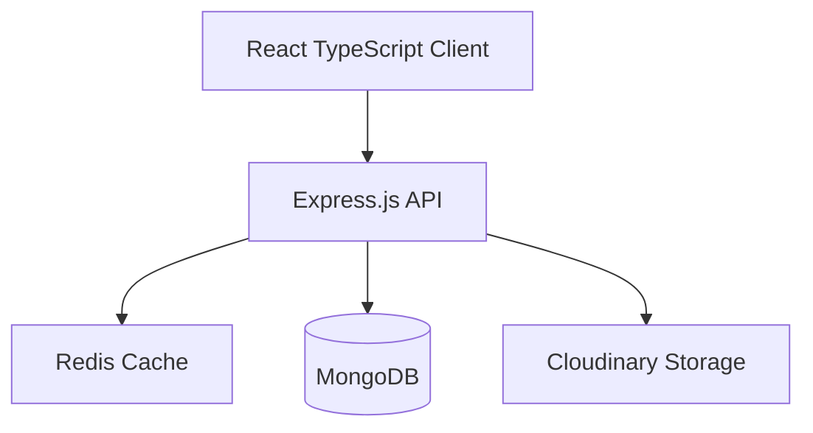
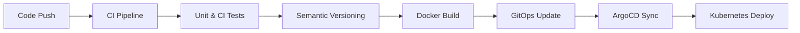

# 🏠 FULLSTACK MERN Real Estate Platform + Enterprise-Grade DevOps + Kubernetes

[](https://github.com/famasboy888/mern_stack_realty/actions)
[](https://hub.docker.com/r/famasboy888/mern-realty-api)
[](https://hub.docker.com/r/famasboy888/mern-realty-client)
[](https://argo-cd.readthedocs.io/)

A full-stack real estate platform built with modern technologies and enterprise-level DevOps practices. This project showcases my expertise in both software development and DevOps engineering.

## 🌟 Key Features

### Enterprise-Grade Architecture
- **Microservices Architecture** using MERN Stack (MongoDB, Express.js, React, Node.js)
- **Docker Containerization** with multi-stage builds for optimal production images
- **Kubernetes Orchestration** with multi-environment support (Dev, Staging, Production)
- **GitOps Implementation** using ArgoCD for automated deployments

## 🌟 Highlights

### Modern Development Practices
- **Full-Stack Development**: MERN Stack with TypeScript
- **Enterprise Security**: JWT, Helmet, Rate Limiting, CORS
- **Cloud Integration**: Cloudinary, MongoDB Atlas, Redis
- **DevOps Excellence**: Docker, Kubernetes(K8s), ArgoCD, GitOps
- **Professional Standards**: Semantic Versioning, Swagger, Testing

### 🏗️ Architecture Overview




### Robust DevOps Pipeline


## 🚀 Technical Stack

### Frontend
- React 18 with TypeScript
- Redux Toolkit for state management
- TailwindCSS for styling
- Vite for blazing fast builds

### Backend
- Node.js with Express
- MongoDB with Mongoose
- JWT Authentication
- Jest and SuperTest for Testing
- API Documentation with Swagger

### DevOps & Infrastructure
- Docker & DockerHub
- Kubernetes (K8s)
- ArgoCD for GitOps
- GitHub Actions for CI/CD
- Semantic Versioning

## 💻 Development Practices

### Test-Driven Development (TDD)
```typescript
describe('Property Listing', () => {
  it('should create new property listing', async () => {
    // Test implementation
  });
});
```

### GitOps Workflow
```yaml
apiVersion: argoproj.io/v1alpha1
kind: Application
metadata:
  name: mern-realty-staging
spec:
  source:
    repoURL: https://github.com/famasboy888/mern_stack_realty_gitOps_kubernetes
    path: overlays/staging
```

## 🌐 Multi-Environment Setup
- **Development**: Rapid iteration environment
- **Staging**: Pre-production testing
- **Production**: Live environment with high availability

## 📈 CI/CD Pipeline Features
- Automated testing on every push
- Semantic versioning for releases
- Containerized builds
- Automated deployments via GitOps
- Environment-specific configurations

## 🛠️ Infrastructure as Code
- Kubernetes manifests with Kustomize
- ArgoCD configurations
- Docker Compose for local development
- GitHub Actions workflows

## 🔒 Security Features
- JWT Authentication
- Environment variable management
- Secrets management in Kubernetes
- HTTPS enforcement
- Docker security best practices

## 🌟 Professional Standards
- Semantic Commit Messages
- Comprehensive Documentation
- Code Quality Checks
- Performance Optimization
- Security Best Practices

## 📫 Contact & Links
- [LinkedIn](https://www.linkedin.com/in/kyle-yap-8888zip/)
- [Docker Hub](https://hub.docker.com/r/famasboy888)

---

This project demonstrates my ability to build and maintain enterprise-grade applications using modern technologies and DevOps practices. It showcases my skills in:
- Full-stack Development
- Cloud Native Technologies
- DevOps & Automation
- Security & Best Practices
- Enterprise Architecture

*Feel free to reach out for collaboration or opportunities!*
